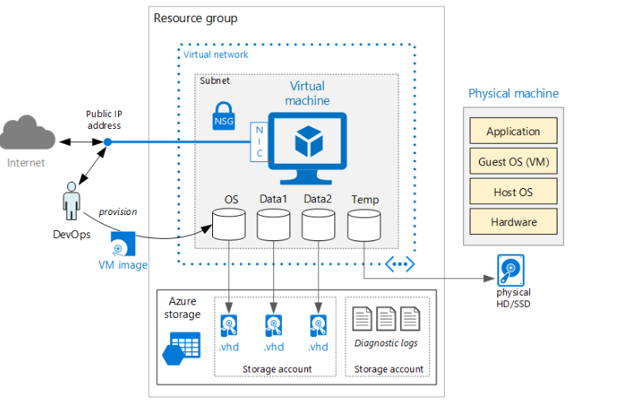

----------------
# Running a Windows VM on Azure

## Description

This configuration runs a single Windows virtual machine (VM) on Azure.  
Using a single VM for production workloads is not recommended, because there is no up-time SLA for single VMs on Azure.  To get the SLA, multiple VMs must be deployed in an availability set ([see Running multiple Windows VMs on Azure](https://azure.microsoft.com/en-us/documentation/articles/guidance-compute-multi-vm/))

## Prescriptive Guidance
Prescriptive  guidance plus considerations for availability, manageability, and security is available [here](https://azure.microsoft.com/en-us/documentation/articles/guidance-compute-single-vm/).

## Architecture diagram
 

## Related Training
* [Networking basics for building applications in Azure](https://azure.microsoft.com/en-us/documentation/videos/azurecon-2015-networking-basics-for-building-applications-in-azure/)
* [Microsoft Azure Fundamentals: Configure an Availability Set](https://azure.microsoft.com/en-us/documentation/articles/virtual-machines-windows-create-availability-set/)

## Tools
* [Installing the Azure CLI](https://azure.microsoft.com/en-us/documentation/articles/xplat-cli-install/)
* [Installing and configuring Azure PowerShell](https://azure.microsoft.com/en-us/documentation/articles/powershell-install-configure/)

## Deployment

### Deploy using the Azure Portal
[](https://valoremconsulting.github.io/AzureCLI/redirect.html)

You will need to be logged into the Azure portal under the subscription you would like to use.

### PowerShell
```PowerShell
New-AzureRmResourceGroup -ResourceGroupName JJJJJ -location "Central US"
New-AzureRmResourceGroupDeployment -ResourceGroupName JJJJJ -TemplateUri "https://clijsonpublic.blob.core.windows.net/svm-stageartifacts/azuredeploy.json" -TemplateParameterUri "https://clijsonpublic.blob.core.windows.net/svm-stageartifacts/azuredeploy.parameters.json"

```
[Install and configure Azure PowerShell](https://azure.microsoft.com/en-us/documentation/articles/powershell-install-configure/)

### CLI
```
1. azure group create -n "JJJJJ" -l "Central US"
2. azure group deployment create -f "https://clijsonpublic.blob.core.windows.net/svm-stageartifacts/azuredeploy.json" -e "https://clijsonpublic.blob.core.windows.net/svm-stageartifacts/azuredeploy.parameters.json" JJJJJ testSingleDeploy
```
[Install and Configure the Azure Cross-Platform Command-Line Interface](https://azure.microsoft.com/en-us/documentation/articles/xplat-cli-install/)

