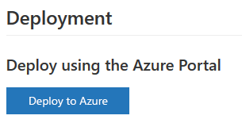
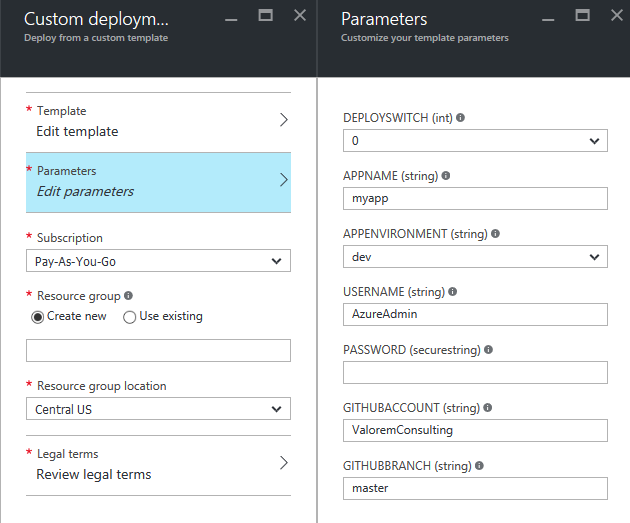
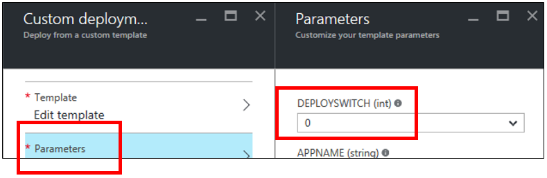
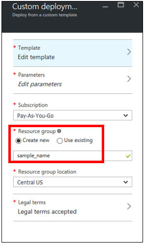
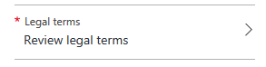
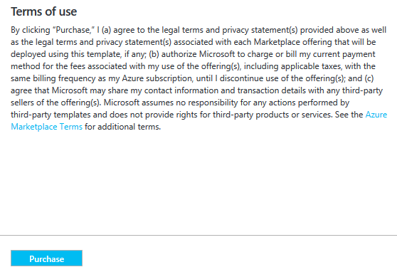
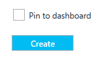
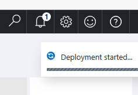

##Deploy To Azure

Deploying Azure resources via the "Deploy to Azure" button

1. Log into your Azure subscription at [portal.azure.com](https://portal.azure.com).  
2. Navigate to the desired template in GitHub and click the "Deploy to Azure" button under the deployment header.  
  
3. Users will be directed to the Azure portal, and the "Custom Deployment" menu will be displayed.  
   
4. Click "Parameters" button
 1. To __deploy with the sample application__, set "DEPLOYSWITCH" to 1
 2. To __deploy without the sample application__, set "DEPLOYSWITCH" to 0
 3. No other fields require changes  
  
5. Click "OK" to exit the Parameters menu.  
  
6. Under the "Custom Deployment" menu, designate a Resource Group name.  
   
7. Under the "Custom Deployment" menu, click the "Legal terms" button.  
   
8. Review legal terms and click "Purchase" to move forward.  
   
9. Click "Create" to start the deployment.  
   
10. OPTION: select "Pin to Dashboard" to review deployment status on your personal dashboard.  
  
11. If the status is not pinned to the user's dashboard, progress can be tracked by clicking the bell icon in the top right corner of the page.  
  
