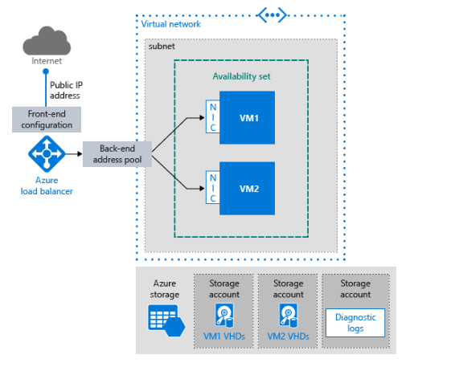

# Running multiple VMs on Azure for scalability and availability

## Description
This configuration is meant for running multiple instances with the same VM image.  The intended scenario is a single-tier app, such as a stateless web app or storage cluster, using multiple instances for scalability and availability.  Multi-tier applications are not included.

In this architecture, the workload is distributed across the VM instances. There is a single public IP address, and Internet traffic is distributed to the VMs using a load balancer. This architecture can be used for a single-tier app, such as a stateless web app or storage cluster. It is also a building block for N-tier applications.

## Architecture diagram


## Prescriptive Guidance
Prescriptive  guidance plus considerations for availability, manageability, and security is available [here](https://azure.microsoft.com/en-us/documentation/articles/guidance-compute-multi-vm/).

## Related Training
* [Networking basics for building applications in Azure](https://azure.microsoft.com/en-us/documentation/videos/azurecon-2015-networking-basics-for-building-applications-in-azure/)
* [Microsoft Azure Fundamentals:  Configure an Availability Set](https://azure.microsoft.com/en-us/documentation/articles/virtual-machines-windows-create-availability-set/)

## Tools
* [Installing the Azure CLI](https://azure.microsoft.com/en-us/documentation/articles/xplat-cli-install/)
* [Installing and configuring Azure PowerShell](https://azure.microsoft.com/en-us/documentation/articles/powershell-install-configure/)

## Deployment

The template is set up to deploy a 3-tier sample web application to demonstrate the template’s functionality.  Users can deploy infrastructure only, without the sample application, via the “Deploy to Azure” button.  Instructions for deploying via the button, both with and without the sample application, are [included here](./DeployToAzure.md).

### Deploy using the Azure Portal
[](https://valoremconsulting.github.io/AzureCLI/redirect.html)

You will need to be logged into the Azure portal under the subscription you would like to use.

### PowerShell
```PowerShell
New-AzureRmResourceGroup           -ResourceGroupName YourResourceGroup2 -location "Central US"
New-AzureRmResourceGroupDeployment -ResourceGroupName YourResourceGroup2 -TemplateUri "https://clijsonpublic.blob.core.windows.net/mvm-stageartifacts/azuredeploy.json" -TemplateParameterUri "https://clijsonpublic.blob.core.windows.net/mvm-stageartifacts/azuredeploy.parameters.json"

```
[Install and configure Azure PowerShell](https://azure.microsoft.com/en-us/documentation/articles/powershell-install-configure/)

### CLI
```
azure group create            -n YourResourceGroup2 -l "Central US"
azure group deployment create -g YourResourceGroup2 -f "https://clijsonpublic.blob.core.windows.net/mvm-stageartifacts/azuredeployGitHub.json" -p "{\"deploySwitch\":{\"value\":1}}"
```
[Install and Configure the Azure Cross-Platform Command-Line Interface](https://azure.microsoft.com/en-us/documentation/articles/xplat-cli-install/)
