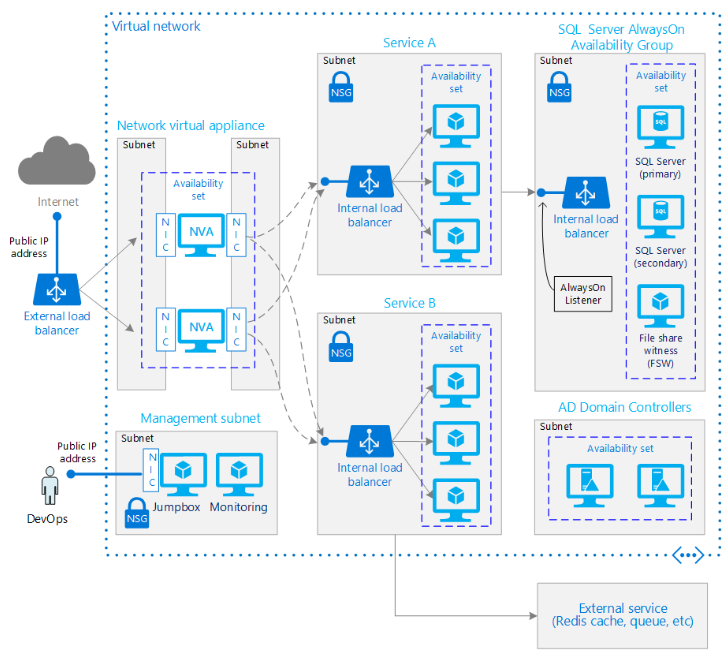

# Running VMs for an N-tier architecture on Azure

 

## Description
Lorem ipsum dolor sit amet, consectetur adipiscing elit. Aenean tortor quam, dictum eu lacus non, porta dignissim eros. Proin vitae tortor ullamcorper, fringilla purus ut, sagittis nulla. Cum sociis natoque penatibus et magnis dis parturient montes, nascetur ridiculus mus. In mattis enim id blandit posuere. Vivamus euismod eu augue quis convallis. Donec ut pharetra tellus, vitae tempor ante. Vestibulum ullamcorper purus a eros hendrerit, et consequat lacus suscipit. Mauris tempor commodo magna, ut porta odio viverra et. Maecenas eget magna vel ipsum laoreet gravida.

## Prescriptive Guidance
Quisque a justo interdum, faucibus lorem id, laoreet purus. Duis eu volutpat velit. Aenean ullamcorper purus vel aliquet suscipit. Donec vel nulla a lacus ultrices faucibus. Vestibulum vehicula tristique lorem, auctor dapibus ex iaculis sit amet.
[Learn more](http://github.com)

## Related Training
* http://github.com
* http://msn.com

## Tools
Quisque a justo interdum,
[Mac](http://github.com) | [Linux](http://github.com) | [Windows](http://github.com) | [Azure PowerShell](http://github.com)

## Sample solution
The sample solution configures a stateless web presence application running on each instance.

## Deploy using CLI
* Download scripts from [here](http://github.com).
* [How to video](http://github.com) (3 min)

## Deploy using PowerShell
* Download scripts from [here](http://github.com).
* [How to video](http://github.com) (3 min)

## Deploy using ARM Template
* Download scripts from [here](http://github.com).
* [How to video](http://github.com) (3 min)
