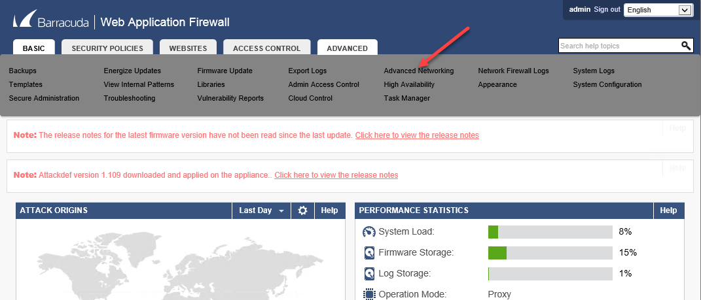
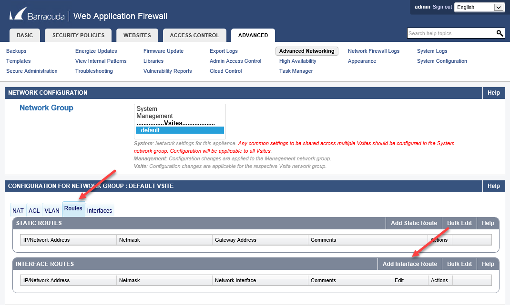
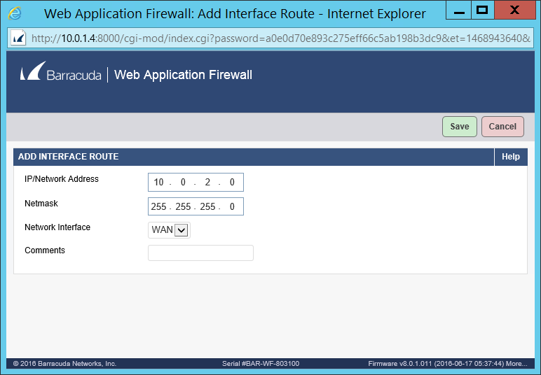
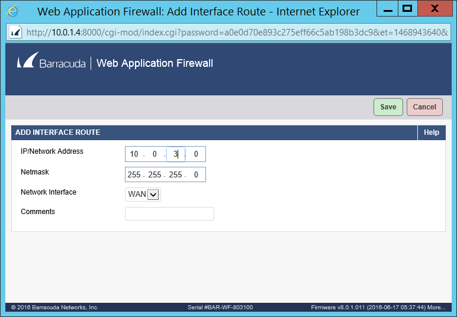

##Configure Barracuda WAF to pass traffic from the internet to the backend Web Server

1.	Login to Azure after you have deployed the template.
2.	Locate both of the Barracuda NVA Virtual Machines private IP addresses in the Azure portal. If no changes were made to the template the IP addresses should be 10.0.1.4 and 10.0.1.5.
3.	RDP into the management box which should be labeled in Azure as myapp-qa-mgmt-vm.
4.	Once logged into the mgmt. system go to Server Manager and under local server turn off “IE Enhanced Security Configuration”.
5.	From the Jump Box open a web browser and go to [http://privateIP:8000](http://privateip:8000/).
6.	At the barracuda login use this info to login.
 1.	Username: admin
 2.	Password: Sw!mmingP00l
7.	Once logged in click on the Advanced Tab>Advanced Networking.  
  
8. In the Configuration for Network Group: Default Vsites click on the Routes tab.
9.	In the section labeled Interface Routes click on “Add Interface Route”.  
  
10.	In the dialog box that appears fill in the IP subnet for the backend web services.  
  
  
This Completes the Barracuda WAF deployment.
