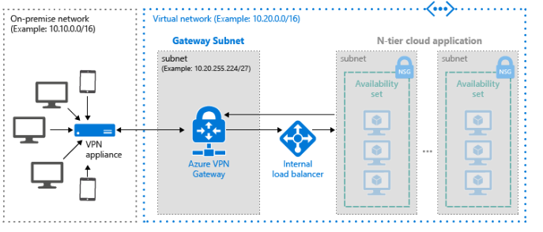

# Virtual Data Center

## Overview
A set of proven practices for running a reliable N-tier architecture on Windows virtual machines (VMs) in Microsoft Azure. Builds on Running VMs for an N-tier architecture on Azure.   Additional components are included that can increase the reliability of the application:

* A network virtual appliance for greater network security.
* SQL Server AlwaysOn Availability Groups for high availability in the data tier

## Prescriptive Guidance
Prescriptive  guidance plus considerations for availability, manageability, and security is available [here](https://azure.microsoft.com/en-us/documentation/articles/guidance-hybrid-network-vpn/#troubleshooting).

 
 
## Related Training
 * [Azure Network Security Groups (NSGs)](https://azure.microsoft.com/en-us/documentation/articles/virtual-networks-nsg/)
 * [Adding reliability to an N-tier architecture on Azure](https://azure.microsoft.com/en-us/documentation/articles/guidance-compute-n-tier-vm/)
 * [Networking basics for building applications in Azure](https://azure.microsoft.com/en-us/documentation/videos/azurecon-2015-networking-basics-for-building-applications-in-azure/)
 * [Microsoft Azure Fundamentals:  Configure an Availability Set](https://azure.microsoft.com/en-us/documentation/articles/virtual-machines-windows-create-availability-set/)

## Tools
 * [Installing the Azure CLI](https://azure.microsoft.com/en-us/documentation/articles/xplat-cli-install/)
 * [Installing and configuring Azure PowerShell](https://azure.microsoft.com/en-us/documentation/articles/powershell-install-configure/)

## Deployment

### Deploy using the Azure Portal
[](https://portal.azure.com/#create/Microsoft.Template/uri/https%3A%2F%2Fraw.githubusercontent.com%2FAzure%2Fazure-quickstart-templates%2Fmaster%2F201-vm-sql-full-autopatching%2Fazuredeploy.json)

You will need to be logged into the Azure portal under the subscription you would like to use.

### PowerShell
```PowerShell
New-AzureRmResourceGroupDeployment -Name <deployment-name> -ResourceGroupName <resource-group-name> -TemplateUri <template-uri>
```
[Install and configure Azure PowerShell](https://azure.microsoft.com/en-us/documentation/articles/powershell-install-configure/)

### CLI
```
azure config mode arm
azure group deployment create <my-resource-group> <my-deployment-name> --template-uri <template-uri>
```
[Install and Configure the Azure Cross-Platform Command-Line Interface](https://azure.microsoft.com/en-us/documentation/articles/xplat-cli-install/)

