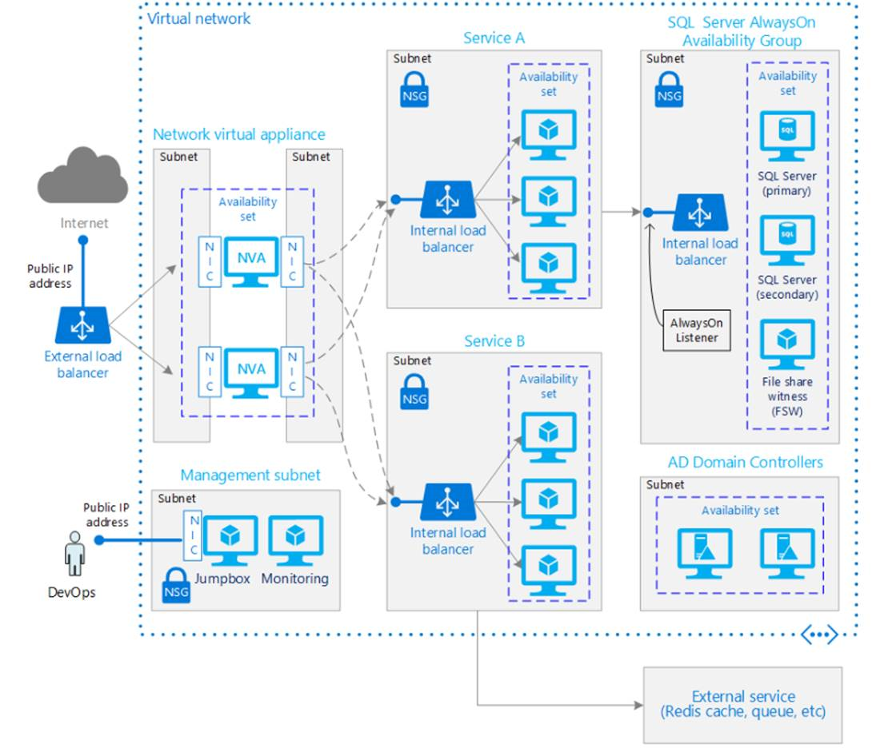

# Virtual Data Center

## Overview
A set of proven practices for running a reliable N-tier architecture on Windows virtual machines (VMs) in Microsoft Azure. Builds on Running VMs for an N-tier architecture on Azure.   Additional components are included that can increase the reliability of the application:

* A network virtual appliance for greater network security.
* SQL Server AlwaysOn Availability Groups for high availability in the data tier

## Prescriptive Guidance
Prescriptive  guidance plus considerations for availability, manageability, and security is available [here](https://azure.microsoft.com/en-us/documentation/articles/guidance-hybrid-network-vpn/#troubleshooting).

 
 
## Related Training
 * [Azure Network Security Groups (NSGs)](https://azure.microsoft.com/en-us/documentation/articles/virtual-networks-nsg/)
 * [Adding reliability to an N-tier architecture on Azure](https://azure.microsoft.com/en-us/documentation/articles/guidance-compute-n-tier-vm/)
 * [Networking basics for building applications in Azure](https://azure.microsoft.com/en-us/documentation/videos/azurecon-2015-networking-basics-for-building-applications-in-azure/)
 * [Microsoft Azure Fundamentals:  Configure an Availability Set](https://azure.microsoft.com/en-us/documentation/articles/virtual-machines-windows-create-availability-set/)

## Tools
 * [Installing the Azure CLI](https://azure.microsoft.com/en-us/documentation/articles/xplat-cli-install/)
 * [Installing and configuring Azure PowerShell](https://azure.microsoft.com/en-us/documentation/articles/powershell-install-configure/)

##Barracuda NVA

This template provisions two Network Virtual Appliance (NVAs) via 3rd party vendor Barracuda.  Be aware of the following addition charges provisioning this NVA (costs below reflect the costs for a single NVA):

Offer details  
1.7600 USD/hr  
Barracuda Web Application Firewall  
by Barracuda Networks, Inc.

Terms of use | [privacy policy](https://www.barracuda.com/legal/privacy)  
0.2400 USD/hr  
[Pricing for other VM sizes](http://azure.microsoft.com/pricing/details/virtual-machines/#Linux)  
Standard A3  
by Microsoft  
[Terms of use](http://azure.microsoft.com/support/legal/) | [privacy policy](https://www.microsoft.com/privacystatement/en-us/OnlineServices/Default.aspx)

**The highlighted Marketplace purchase(s) are not covered by your Azure credits, and will be billed separately.**  
You cannot use your Azure monetary commitment funds or subscription credits for these purchases. You will be billed separately for marketplace purchases.
If you have previously purchased a free trial offering, your free trial period will run 30 days from the date of your original purchase; all use thereafter will be billed at the standard rates listed above.

**Azure resource**  
You may use your Azure monetary commitment funds or subscription credits for these purchases. Prices presented are retail prices and may not reflect discounts associated with your subscription.
Terms of use
By clicking “Purchase”, I (a) agree to the legal terms and privacy statement(s) associated with each Marketplace offering above, (b) authorize Microsoft to charge or bill my current payment method for the fees associated with my use of the offering(s), including applicable taxes, with the same billing frequency as my Azure subscription, until I discontinue use of the offering(s), and (c) agree that Microsoft may share my contact information and transaction details with the seller(s) of the offering(s). Microsoft does not provide rights for third-party products or services. See the [Azure Marketplace Terms](http://azure.microsoft.com/support/legal/marketplace-terms/) for additional terms.

**Post Deployment Configuration**
In order to get web traffic to make it from the internet to the backend web service areas, please follow the instructions listed in this document. [Post Deployment Configuration Documentation ](./BarracudaNVADocumentation.md)

##Barracuda NVA

Any troubleshooting related to the NVA should go through Barracuda at [https://www.barracuda.com/support](https://www.barracuda.com/support)

## Deployment

The template is set up to deploy a 3-tier sample web application to demonstrate the template’s functionality.  Users can deploy infrastructure only, without the sample application, via the “Deploy to Azure” button.  Instructions for deploying via the button, both with and without the sample application, are [included here](./DeployToAzure.md).

### Deploy using the Azure Portal
[](https://valoremconsulting.github.io/AzureCLI/redirect.html)

You will need to be logged into the Azure portal under the subscription you would like to use.

### PowerShell
```PowerShell
New-AzureRmResourceGroup -ResourceGroupName YOURRESOURCEGROUPVDC -location "Central US"
New-AzureRmResourceGroupDeployment -ResourceGroupName YOURRESOURCEGROUPVDC –TemplateUri "https://clijsonpublic.blob.core.windows.net/HybridNetwork-stageartifacts/azuredeploy.json" –TemplateParameterUri "https://clijsonpublic.blob.core.windows.net/HybridNetwork-stageartifacts/azuredeploy.parameters.json"


```
[Install and configure Azure PowerShell](https://azure.microsoft.com/en-us/documentation/articles/powershell-install-configure/)

### CLI
```
1. azure group create            -n "YourResourceGroupHN" -l "Central US"
2. azure group deployment create -g "YourResourceGroupHN" -f https://raw.githubusercontent.com/ValoremConsulting/AzureCLI/master/5-HybirdNetwork/Templates/azuredeployGitHub.json” -p "{\"deploySwitch\":{\"value\":1}}"

```
[Install and Configure the Azure Cross-Platform Command-Line Interface](https://azure.microsoft.com/en-us/documentation/articles/xplat-cli-install/)

